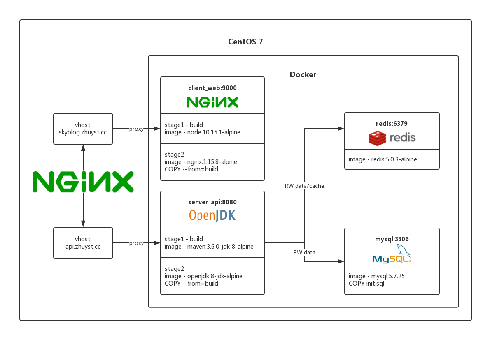

# SkyBlog

该项目是一个阅读与管理合一的轻量级博客，仅支持Markdown编辑。

项目使用前后端分离架构，所以部署在Github和自己的服务器各部署了一份前端网页。

项目整体运用了`Docker`进行构建与运行，并且使用`DockerCompose`来启动。

构建与运行应用了Docker在17.05新增的特性：[Use multi-stage builds](https://docs.docker.com/develop/develop-images/multistage-build/)，解放了构建机需要对应环境的问题。

# 系统结构



# 快速开始

```sh
docker-compose up -d
```

## 前端项目 —— Client Web

运用了`NodeJS`镜像进行项目的构建，然后将构建产物`COPY`到`nginx`镜像中，详情见[Dockerfile](./client_web/Dockerfile)

Github Pages : [zhuyst.github.io](https://zhuyst.github.io)

Nginx : [skyblog.zhuyst.cc](https://skyblog.zhuyst.cc)

前端使用[create-react-app](https://github.com/facebook/create-react-app)创建，并且还使用了以下框架/工具：

* 路由：[reactr-router](https://github.com/ReactTraining/react-router)
* 状态管理工具：[redux](https://github.com/reactjs/redux)
* 界面：[react-bootstrap](https://github.com/react-bootstrap/react-bootstrap)
* CSS动画: [react-transition-group](https://github.com/reactjs/react-transition-group)
* Markdown渲染：[react-markdown](https://github.com/rexxars/react-markdown)
* Markdown编辑器：[react-mde](https://github.com/andrerpena/react-mde)
* 通知：[reapop](https://github.com/LouisBarranqueiro/reapop)

## 后端项目 —— Server API

运用了`Maven`镜像进行构建，然后将构建后的`app.jar`文件`COPY`到`openjdk`镜像中，然后使用`docker`配置文件启动项目，详情见[Dockerfile](./server_api/Dockerfile)

Swagger : [api.zhuyst.cc](https://api.zhuyst.cc)

1. 后台使用[Spring Boot](https://github.com/spring-projects/spring-boot)为基础构建
2. 使用[MyBatis](https://github.com/mybatis/mybatis-3)作为持久层框架
3. 使用[Swagger](https://github.com/swagger-api/swagger-core)生成在线API文档，方便测试与开发
4. 项目有完整的javadoc，并且已通过[阿里巴巴编码规范](https://github.com/alibaba/p3c)插件的检测

后台API采用[Spring Security](https://github.com/spring-projects/spring-security)来作为安全框架，并且整合了[JWT](https://github.com/jwtk/jjwt)来生成`Token`。

数据库方面则使用`MySQL`作为持久化，`Redis`作为缓存，使用缓存来减少数据查询的消耗。